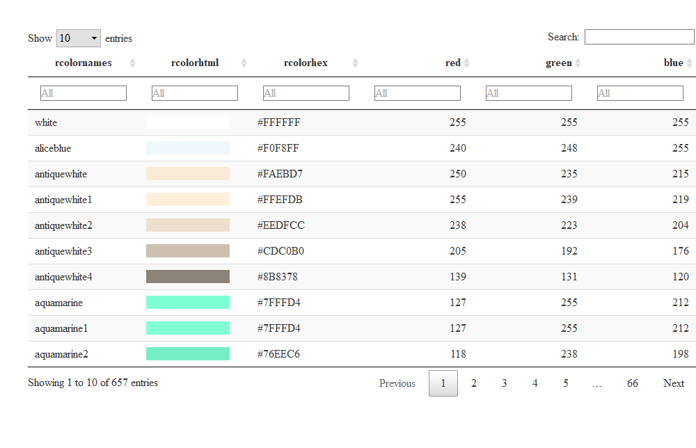

<!-- README.md is generated from README.Rmd. Please edit that file -->

# rcolorutils

<!-- badges: start -->
<!-- badges: end -->

This package is designed to help you work with R’s built-in colors.

## Installation

rcolorutils isn’t on CRAN, so you’ll need to install it with from
[GitHub](https://github.com/) with:

``` r
# install.packages("devtools")
devtools::install_github("smach/rcolorutils", build_vignettes = TRUE)
```

## What You Can Do

You can generate a searchable table with all colors with the
`create_color_table()` function. The function’s only argument is the
length of the table page, which defaults to 25.

With columns for red, green, and blue, you can sort and filter the table
by rgb color attributes as well as color name or hex code.

``` r
library(rcolorutils)
create_color_table(page_length = 10)
```



rcolorutils also has functions to help you find built-in colors that are
similar to one specific color. It’s especially useful to answer a
question like “what other blues are built in to R”?

The `nearRcolor()` function will return a vector of nearby colors:

``` r
nearRcolor("skyblue")
#>           0.0000           0.0412           0.0507           0.0529 
#>        "skyblue"     "cadetblue2"       "skyblue2" "darkslategray2" 
#>           0.0699           0.0875           0.0926           0.0938 
#>   "lightskyblue"     "cadetblue1"       "skyblue1" "darkslategray1"
```

``` r
nearRcolor("tomato")
#>       0.0000       0.0281       0.0374       0.0403       0.0589       0.0643 
#>     "tomato"    "sienna1"     "brown1"      "coral"     "coral1"       "tan1" 
#>       0.0667       0.0723       0.0776       0.0882       0.0918       0.0937 
#>    "tomato2"    "sienna2"     "brown2"     "coral2"       "tan2" "firebrick1"
```

If you’d like to *see* the colors, wrap the results of `nearRcolor()` in
the `plotCol()` function:

``` r
plotCol(nearRcolor("skyblue"), nrow = 2)
#> Loading required package: grid
```


``` r
plotCol(nearRcolor("tomato"), nrow = 3)
```


Note that the scales package’s `show_col()` function is another way to
display the colors:

``` r
scales::show_col(nearRcolor("green"))
```


If you don’t get enough colors, increase the distance.

``` r
plotCol(nearRcolor("darkgreen"))
```


You may have to fiddle with the distance number to get what you want.

``` r
plotCol(nearRcolor("darkgreen", "rgb", dist = 80))
```


